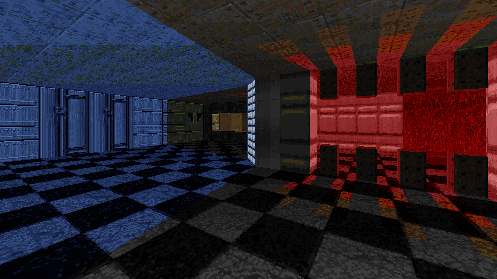
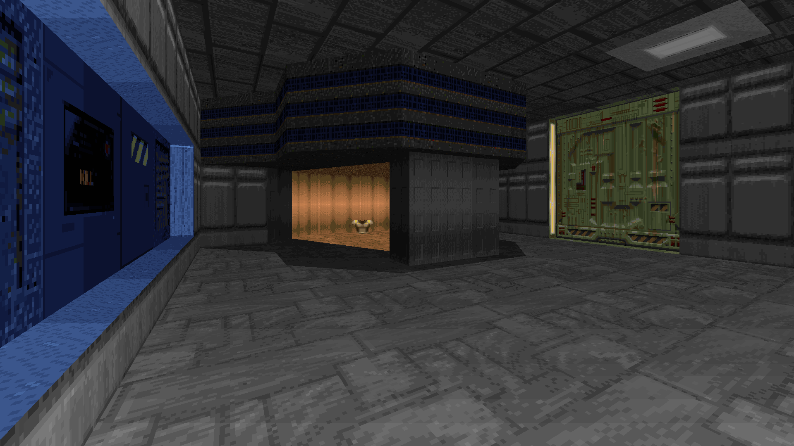
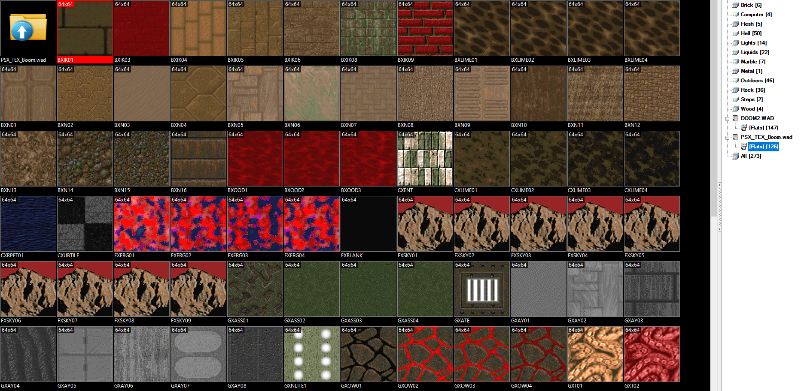
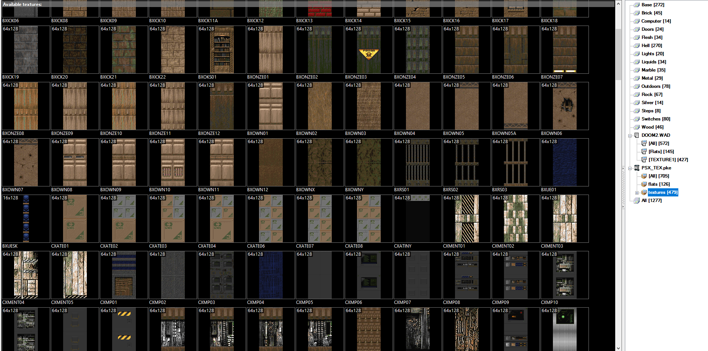

# PSXTex by DRON12261 [Resource for Mapping]
Doom PSX Textures

# STATUS: ✅RELEASED

## Download:
- [Texture Pack (for Eternity Engine and ZDoom)](https://github.com/dron12261games/RES-CyberTechTEX/releases/download/v1/CyberTechTEX.zip)
- [Texture Pack (for Boom)](https://github.com/dron12261games/RES-CyberTechTEX/releases/download/v1/CyberTechTEX.zip)

# Example screenshots:

